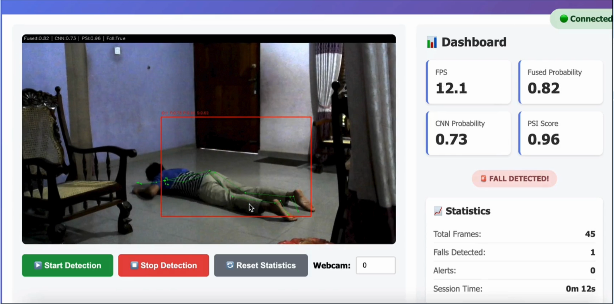
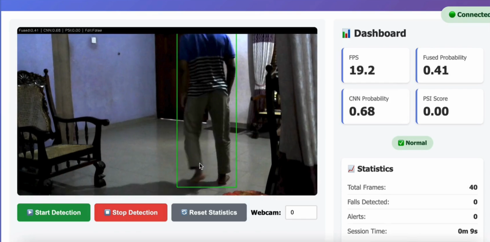

# Fall Detection System for Elderly Homes

## 📸 Demo

### ✅ Fall Detected (True Positive)
> Person detected mid-fall - bounding box active, PSI threshold breached, alert triggered.



### 🟢 Normal State (True Negative)
> Person standing upright - bounding box stable, PSI within safe range, no alert.




A **machine vision** system that detects falls in real time from a webcam feed. It combines a **CNN (TFLite)** fall classifier with a **Pose Stability Index (PSI)** derived from body pose, and exposes a **web interface** over **HTML and WebSockets** for live video, metrics, and alerts.

## What It Does

- **Person detection**: YOLOv5 detects people in each frame; each person crop is classified and tracked.
- **Fall classification**: A quantized **TFLite** model (128×128 person crops) outputs a fall probability per person.
- **PSI (Pose Stability Index)**: From **MediaPipe Pose** landmarks, the system computes a stability score using:
  - Torso angle relative to vertical
  - Hip vertical velocity (FPS-normalized)
  - Head–hip distance (normalized)

  PSI is fused with the CNN probability (e.g. 35% PSI, 65% CNN) for a single fall score per person.
- **Temporal logic**: Exponential moving average smoothing and a short “confirmed fall” window reduce false triggers; only then is an alert raised and a snapshot saved.
- **Web UI**: An **HTML** dashboard is served by FastAPI. Two **WebSockets** stream:
  - **`/ws/video`**: Real-time annotated video frames (base64 JPEG).
  - **`/ws/dashboard`**: Live metrics (FPS, fused prob, CNN prob, PSI), stats (frames, falls, session time), and recent alerts.
- **REST API**: Endpoints to start/stop detection (with webcam index), reset stats, list alerts and saved captures, and serve saved fall images.
- **Alerts and captures**: When a fall is confirmed, the current frame is saved under `fall_captures/` with per-person cooldown to avoid duplicate saves; alerts appear in the dashboard and can be clicked to view the image.

## Repository Contents

| Item | Description |
|------|-------------|
| `fastapi_server.py` | FastAPI app: static files, REST routes, WebSocket handlers (`/ws/video`, `/ws/dashboard`), and the background video processing loop. |
| `fall_detector_core.py` | Core vision logic: load TFLite/YOLO/MediaPipe, run CNN + PSI, person tracker (IoU), temporal smoothing, fall decision, and frame annotation. |
| `static/index.html` | Single-page web UI: video feed, Start/Stop/Reset, webcam index, live metrics (FPS, fused, CNN, PSI), fall status, stats, and recent alerts with image modal. |
| `Model_Training.ipynb` | Jupyter notebook for training the fall classifier (e.g. MobileNetV2-based) on a Roboflow-style dataset (person crops, 128×128), with evaluation and export to TFLite. |
| `fall-detector-lite.tflite` | Deployed fall classifier (quantized, edge-optimized). |
| `fall-detector.h5` | Optional Keras weights (if you retrain and export again). |
| `yolov5s.pt` | YOLOv5 weights for person detection. |
| `fall_captures/` | Directory where fall snapshots are saved (e.g. `fall_capture_MM-DD_HH-MM-SS_personN.jpg`). |

## Requirements

- Python 3.8+
- **OpenCV** (`opencv-python`)
- **TensorFlow** (for TFLite interpreter and optional training)
- **PyTorch** (for YOLOv5)
- **MediaPipe**
- **FastAPI**
- **NumPy**, **Pandas**, **Pillow**

Install example:

```bash
pip install opencv-python tensorflow torch mediapipe fastapi numpy pandas pillow
```

For training (not required for inference): `scikit-learn`, `matplotlib`, `seaborn`; notebook assumes a dataset (e.g. from Roboflow) unzipped as in the notebook.

## How to Run

1. **Clone or download** the repo and ensure `Fall-detector-lite.tflite` and `yolov5s.pt` are in the project root (or set paths in `FallDetectorConfig` in `fall_detector_core.py`).
2. **Install dependencies** (see above).
3. **Start the server**:
   ```bash
   python fastapi_server.py
   ```
   Server runs at **http://localhost:8000** (host `0.0.0.0`, port 8000).
4. **Open in a browser**: Go to **http://localhost:8000**. The HTML page loads; it connects to `ws://<host>/ws/video` and `ws://<host>/ws/dashboard` automatically.
5. **Start detection**: Click **“Start Detection”** (optionally set webcam index, e.g. `0` for default camera). The video stream and dashboard update in real time; when a fall is confirmed, an alert is added and a capture is saved. Use **“Stop Detection”** to release the camera and **“Reset Statistics”** to clear counts and alerts.

## Configuration

Key settings live in `FallDetectorConfig` in `fall_detector_core.py`: TFLite and YOLO paths, fusion weights (`psi_weight`, `cnn_weight`), EMA alpha, fall threshold, required consecutive seconds for confirmation, save directory, target FPS, and MediaPipe/PSI parameters. Adjust there and restart the server to change behavior.

## Training Your Own Model

Use **`Model_Training.ipynb`** to train a fall classifier on your own dataset (e.g. Roboflow export: person crops, labels for fall/not fall). The notebook covers data loading, preprocessing (128×128 crops), model definition (e.g. MobileNetV2), training, evaluation, and exporting to TFLite. Replace `fall-detector-lite.tflite` with your exported file and keep the same input size (128×128) in `FallDetectorConfig` for the current pipeline.
